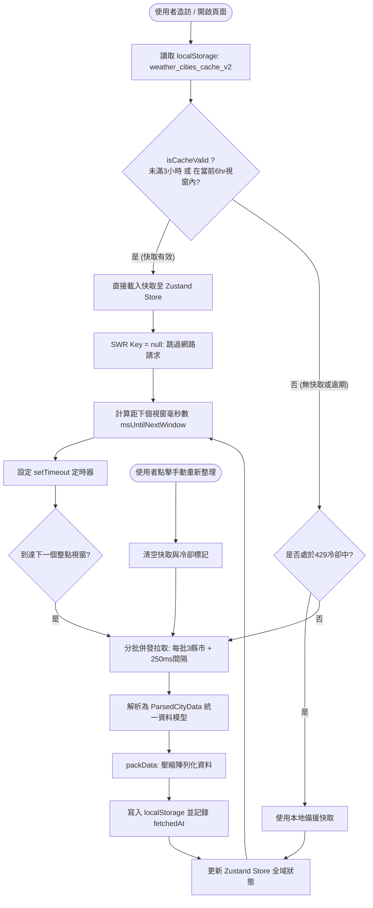

# 台灣天氣預報系統 - API 呼叫制度、快取機制與資料結構完整規範文件

本文件詳細說明本專案與中央氣象署（CWA）Open API 對接的呼叫制度、週期頻率、快取判斷機制、分批併發流控以及前後端統一資料結構。

---

## 壹、API 呼叫制度與頻率監察報告

### 1. 現行呼叫頻率與觸發制度

本專案採用 **「6 小時時間視窗制度（6-Hour Window Scheduling）」配合「3 小時保證保鮮期」**，對齊中央氣象署每日 4 次主要預報更新節點：

* **時間視窗起點（UTC+8）**：`00:00`、`06:00`、`12:00`、`18:00`。
* **視窗週期跨度**：每 **6 小時**（360 分鐘）為一個獨立的預報視窗。
* **3 小時絕對保鮮期 (`MIN_FRESH_HOURS = 3`)**：無論何時進入，若上次抓取時間距今未滿 180 分鐘，系統保證直接讀取 Storage 暫存，發送 **0 個 API 請求**。

```text
┌───────────┬───────────┬───────────┬───────────┐
│ 00:00視窗 │ 06:00視窗 │ 12:00視窗 │ 18:00視窗 │
└───────────┴───────────┴───────────┴───────────┘
```

#### 自動輪詢／排程觸發機制 (`msUntilNextWindow`)
系統精確計算當前時間距離下一個 6 小時整點起點的毫秒數：
$$\Delta t = \text{NextWindowStart} - \text{CurrentTime}$$
* 範例：若使用者在 14:20 打開網頁，距離下一個視窗起點（18:00）尚有 3 小時 40 分鐘。系統會透過 `setTimeout` 設定在 18:00:00 自動喚醒並發出 `mutate()` 重新拉取新預報。
* 重新拉取完成後，立即遞迴預約下一次視窗的排程，達成真正的低耗能定時同步。

---

### 2. 快取優先檢查機制 (`Cache-First`)

為了防止使用者頻繁刷新頁面或切換元件導致 API 額度超載，系統結合了 **`localStorage` 本地壓縮儲存** 與 **SWR 資料請求快取**：

1. **檢查快取有效性 (`isCacheValid`)**：
   * 檢查本地鍵值 `weather_cities_cache_v2`。
   * 比對快取資料中的 `fetchedAt`（抓取時間戳記）：
     * **條件一（絕對保鮮）**：$\text{CurrentTime} - \text{fetchedAt} < 3\text{ 小時}$ $\rightarrow$ 直接判定有效。
     * **條件二（視窗對齊）**：$\text{WindowStart} \le \text{fetchedAt} < \text{WindowEnd}$ $\rightarrow$ 判定有效。
     * 只有當「既超過 3 小時，又已跨入下一個 6hr 視窗」時，才判定過期。
2. **快取有效時（命中 Cache）**：
   * `getSWRKey()` 回傳 `null`。
   * **完全跳過任何網路 Request，發送 0 個 API 請求**。
   * 直接將快取資料灌入 Zustand 全域 Store，實現「零延遲、首屏秒開」。
3. **快取無效／過期／初次造訪時**：
   * `getSWRKey()` 啟用 `'ALL_CITIES_WEATHER_DATA'`。
   * 觸發網路請求發送，獲取成功後自動壓縮寫入 `localStorage`，記錄最新的 `fetchedAt`。

---

### 3. 分批拉取架構與防 429 限流機制 (`Batch Fetching`)

* **呼叫來源**：交通部中央氣象署開放資料平台（CWA OpenData API）。
* **資料集代碼**：
  * 全台 22 縣市鄉鎮 3 天逐 3 小時預報：`F-D0047-001` ～ `F-D0047-085`。
  * 全台未來 1 週逐 12 小時預報：`F-D0047-091`（單一輕量請求）。
* **分批並發控制 (Batch Size = 3)**：
  為避免一次同時發送 22 支 API 觸發氣象署 WAF 429 拒絕服務，系統改採每批 3 支併發，批次間微間隔 250ms：
  ```ts
  const BATCH_SIZE = 3;
  for (let i = 0; i < CITIES.length; i += BATCH_SIZE) {
    const batch = CITIES.slice(i, i + BATCH_SIZE);
    const batchPromises = batch.map((city) => fetchCity(city));
    await Promise.all(batchPromises);
    if (i + BATCH_SIZE < CITIES.length) {
      await new Promise((resolve) => setTimeout(resolve, 250));
    }
  }
  ```
* **429 降級保護與冷卻機制**：
  * 若偵測到 429 限流，自動啟動 5 分鐘冷卻保護 (`setRateLimitCooldown(5)`)。
  * 冷卻期內或請求失敗時，自動降級使用現有的本地快取資料，確保使用者介面不崩潰。

---

### 4. SWR 防重複與去重保護

* `revalidateOnFocus: false`：切換瀏覽器分頁或視窗切回時，不重新請求。
* `revalidateOnReconnect: false`：斷線重連時，不立即重發，避免重連震盪。
* `dedupingInterval: 60000`（60 秒）：1 分鐘內如果有多個元件同時觸發 mutate，強制去重合併為單次請求。

---

### 5. 手動強制更新機制 (`Manual Refresh`)

* **防刷間隔保護**：手動更新具備冷卻計時保護（預設 10 分鐘內按鈕顯示冷卻中，避免暴力連點）。
* 使用者點擊「重新整理」按鈕時：
  1. 呼叫 `clearCache()` 與 `clearRateLimitCooldown()`。
  2. 呼叫 SWR 的 `refetch()` (`mutate()`)。
  3. 平滑分批重新向中央氣象署請求全台資料並刷新全站狀態。

---

## 貳、API 呼叫與快取決策流程圖



---

## 參、系統資料結構規範 (Data Structure Schema)

### 1. 中央氣象署 (CWA) 原始 API 回傳結構

```ts
// 氣象署單一時段因子值
export interface TimeEntry {
  DataTime?: string;                          // 觀測/預報時間點 (ISO 字串)
  StartTime?: string;                         // 預報時段起點
  EndTime?: string;                           // 預報時段終點
  ElementValue: Record<string, string>[];     // 具體數值物件陣列，如 [{ Temperature: "28" }]
}

// 氣象署天氣因子物件
export interface WeatherElement {
  ElementName: string;                        // 因子名稱: 天氣現象 / 溫度 / 相對濕度 / 舒適度指數 / 風向 / 風速 / 3小時降雨機率 等
  Time: TimeEntry[];                          // 時段資料清單
}

// 鄉鎮行政區物件
export interface Location {
  LocationName: string;                       // 鄉鎮市區名稱，如「中正區」、「板橋區」
  Geocode: string;                            // 地理代碼
  Latitude: string;                           // 緯度
  Longitude: string;                          // 經度
  WeatherElement: WeatherElement[];           // 該鄉鎮包含的所有氣象因子
}

// 縣市資料集容器
export interface Locations {
  DatasetDescription: string;                 // 資料集描述
  LocationsName: string;                      // 縣市名稱，如「臺北市」
  Dataid: string;                             // 資料集代碼，如「D0047-061」
  Location: Location[];                       // 該縣市轄下所有鄉鎮陣列
}

// CWA 頂層 API 回應包裝
export interface ApiResponse {
  success: string;                            // "true"
  result: {
    resource_id: string;
    fields: { id: string; type: string }[];
  };
  records: {
    Locations: Locations[];
  };
}
```

---

### 2. 前端解析後的正規化資料模型 (Normalized Domain Model)

#### (1) `WeatherPeriod`（單一 3 小時預報核心結構）
將氣象署深層嵌套的 `WeatherElement` 解析展平成平鋪物件：

```ts
export interface WeatherPeriod {
  startTime: string;                  // 時段起點 (YYYY-MM-DDTHH:mm:ss+08:00)
  endTime: string;                    // 時段終點 (YYYY-MM-DDTHH:mm:ss+08:00)
  
  // ── 溫度指標 ──
  temperature: string;                // 實測/預估平均氣溫 (°C)
  maxTemperature: string;             // 最高氣溫 (°C)
  minTemperature: string;             // 最低氣溫 (°C)
  maxApparentTemperature: string;     // 最高體感溫度 (°C)
  minApparentTemperature: string;     // 最低體感溫度 (°C)
  
  // ── 水氣與濕度 ──
  relativeHumidity: string;           // 相對濕度 (%)
  dewPoint: string;                   // 露點溫度 (°C)
  probabilityOfPrecipitation: string; // 3 小時降雨機率 (%)
  
  // ── 舒適度 ──
  maxComfortIndex: string;            // 舒適度指數數值
  maxComfortIndexDescription: string; // 舒適度描述 (舒適 / 偏涼 / 悶熱 / 寒冷)
  minComfortIndex: string;            // 最低舒適度指數
  minComfortIndexDescription: string; // 最低舒適度描述
  
  // ── 風況 ──
  windDirection: string;              // 風向 (如「東北風」、「偏南風」)
  windSpeed: string;                  // 平均風速 (m/s)
  beaufortScale: string;              // 蒲福風級 (0~12 級)
  
  // ── 天氣現象 ──
  weather: string;                    // 天氣名稱 (晴時多雲 / 短暫陣雨 等)
  weatherCode: string;                // 氣象署天氣代碼 -> 對應 Meteocons SVG 動態圖示
  weatherDescription: string;         // 天氣預報綜合描述文字
  
  // ── 紫外線 ──
  uvIndex: string;                    // 紫外線指數 (0~12)
  uvExposureLevel: string;            // 紫外線等級 (低量級 / 中量級 / 高量級 / 過量級 / 危險級)
}
```

#### (2) `WeeklyForecastDay`（未來 7 天一週預報結構）
```ts
export interface WeeklyForecastDay {
  dateStr: string;                    // 日期字串 (YYYY-MM-DD)
  dayLabel?: string;                  // 星期幾 (如「週一」)
  minTemp: number;                    // 當日最低溫
  maxTemp: number;                    // 當日最高溫
  maxPop: number;                     // 當日最高降雨機率
  weather: string;                    // 天氣現象
  weatherCode: string;                // 天氣代碼
  description: string;                // 預報描述
  startTime: string;                  // 代表時段起點
}
```

#### (3) `ParsedTownshipData` & `ParsedCityData`
```ts
export interface ParsedTownshipData {
  townshipName: string;               // 鄉鎮市區名稱 (如「新店區」)
  geocode: string;                    // 地理編碼
  latitude: string;                   // 緯度座標
  longitude: string;                  // 經度座標
  periods: WeatherPeriod[];           // 未來 3 天逐 3 小時預報陣列 (約 24 個時段)
}

export interface ParsedCityData {
  cityName: string;                   // 縣市名稱 (如「新北市」)
  datasetId: string;                  // 氣象署資料代碼 (如「F-D0047-069」)
  townships: ParsedTownshipData[];    // 轄下鄉鎮區清單
}
```

#### (4) `CachedData`（本地快取與壓縮儲存）
```ts
export interface CachedData {
  fetchedAt: string;                                   // 資料拉取時的 ISO 8601 時間字串
  cities: ParsedCityData[];                            // 全台 22 縣市完整預報資料
  weeklyForecasts?: Record<string, WeeklyForecastDay[]>; // 未來 7 天各縣市預報
}
```
*註：寫入 LocalStorage 前會由 `packData()` 將 `WeatherPeriod` 的物件 Key 轉換為純陣列索引序列，使 5MB+ 的資料大幅縮減至 1.4MB 以內。*

---

### 3. Zustand 全域狀態結構 (`weatherStore`)

```ts
export interface WeatherState {
  // 資料集
  cities: ParsedCityData[];
  setCities: (data: ParsedCityData[]) => void;
  weeklyForecasts: Record<string, WeeklyForecastDay[]>;
  setWeeklyForecasts: (forecasts: Record<string, WeeklyForecastDay[]>) => void;
  
  // 當前選取縣市與鄉鎮
  selectedCity: string;               // 預設 '臺北市'
  setSelectedCity: (cityName: string) => void;
  selectedTownship: string;           // 預設 '' (自動選取該縣市第 1 個鄉鎮)
  setSelectedTownship: (townshipName: string) => void;
  setSelectedCityAndTownship: (cityName: string, townshipName: string) => void;
  
  // 當前瀏覽 Tab 分類
  activeTab: TabCategory;             // 'overview' | 'temperature' | 'wind' | 'rain' | 'comfort'
  setActiveTab: (tab: TabCategory) => void;
  
  // 當前選取時段
  selectedPeriodTime: string | null;  // null = 自動對應系統當前時段
  setSelectedPeriodTime: (time: string | null) => void;
  
  // 狀態與時間戳
  lastFetchedAt: string | null;
  setLastFetchedAt: (time: string | null) => void;
  isLoading: boolean;
  setIsLoading: (loading: boolean) => void;
  error: string | null;
  setError: (error: string | null) => void;
}
```
